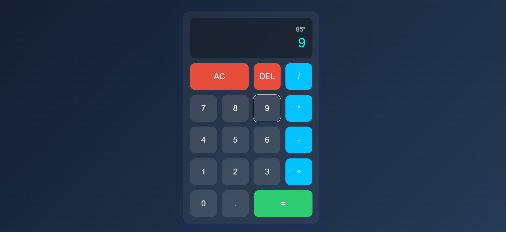

# 🧮 Basic Calculator

A modern and responsive calculator built using **HTML**, **CSS**, and **JavaScript**.  
It supports all basic arithmetic operations and offers a sleek, glassmorphic UI.

---

## 🚀 Features

- Real-time calculations
- Basic operations: `+`, `−`, `×`, `÷`
- Keyboard support
- Clear and Delete buttons
- Responsive design
- Smooth transitions and animations
- Built with clean and modular code

---

## 🛠️ Tech Stack

- ✅ HTML5
- ✅ CSS3 (Glassmorphism, Responsive Design)
- ✅ JavaScript (Vanilla)

---

## 📸 Screenshots

### Desktop View:

---

### Calculation:

---

## 📁 Project Structure

📦 Calculator-App
├── 📄 index.html
├── 📄 style.css
├── 📄 script.js
├── 📁 images/
│ ├── desktop.png
│ └── mobile.png
└── 📄 README.md

---

🤝 Connect with Me:

LinkedIn: www.linkedin.com/in/ayesha-tariq21

---

## 👩‍💻 Author

**Ayesha Tariq**

---

